# Architecture Documentation

## Overview

This is a **vLLM Multi-Model Server** - a production-ready Docker-based deployment system for running multiple large language models using vLLM with LiteLLM proxy integration. It provides OpenAI-compatible API endpoints for various LLMs optimized for different use cases (reasoning, tool calling, code generation, high-throughput serving).

---

## System Architecture

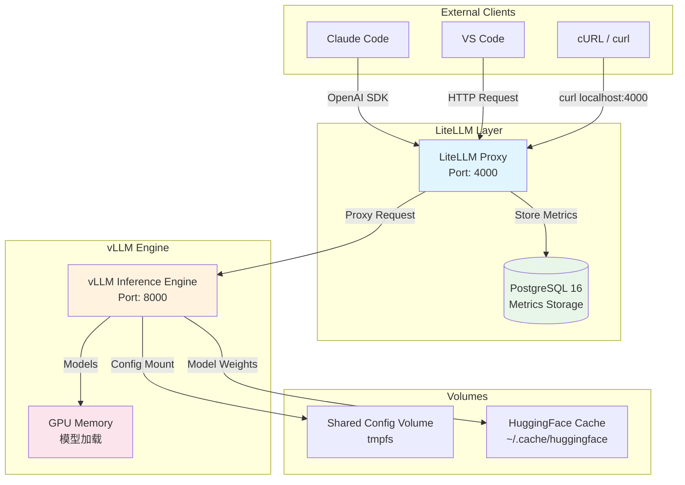

---

## Deployment Architecture

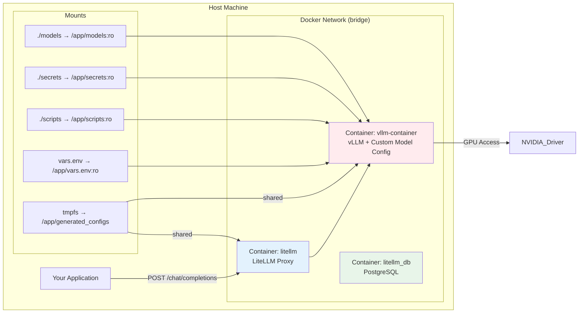

---

## Runtime Flow

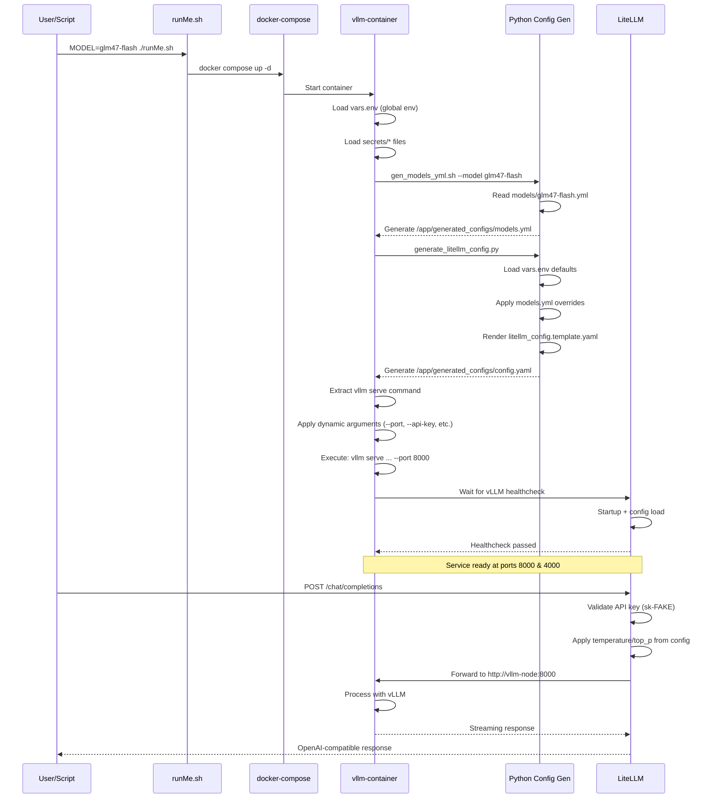

---

## Configuration System

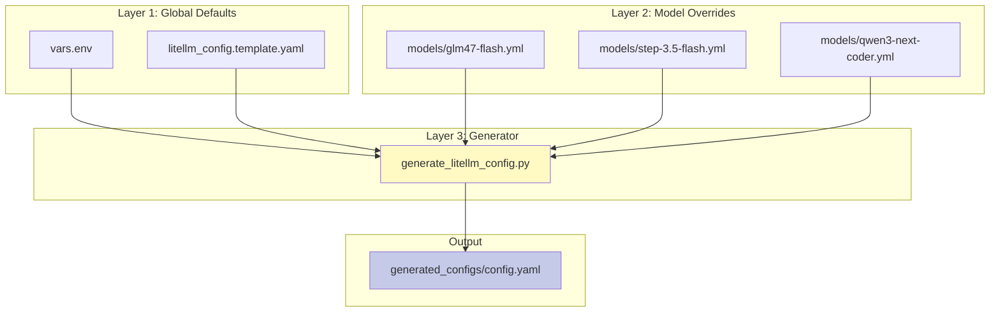

### Configuration Data Flow

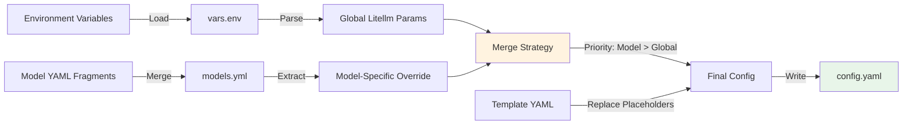

---

## Model Configuration Format

Each model in `models/` follows a consistent three-section structure:

```yaml
# Section 1: vLLM Command (how to serve the model)
command: |
  vllm serve <huggingface-model-id> \
    --tokenizer-mode auto \
    --enable-auto-tool-choice \
    --tool-call-parser <parser> \
    --load-format fastsafetensors \
    --attention-backend flashinfer \
    --enable-prefix-caching \
    --kv-cache-dtype fp8

# Section 2: Model-Specific Environment Variables
env:
  SAFETENSORS_FAST_GPU: "1"
  VLLM_USE_DEEP_GEMM: "1"
  VLLM_FLASHINFER_MOE_BACKEND: "latency"

# Section 3: LiteLLM Parameters (ratelimiting, defaults)
litellm:
  temperature: 0.7
  top_p: 0.9
  top_k: 50
  repetition_penalty: 1.1
  max_tokens: 128K
```

---

## Services Breakdown

### 1. vllm-node (Custom Image)

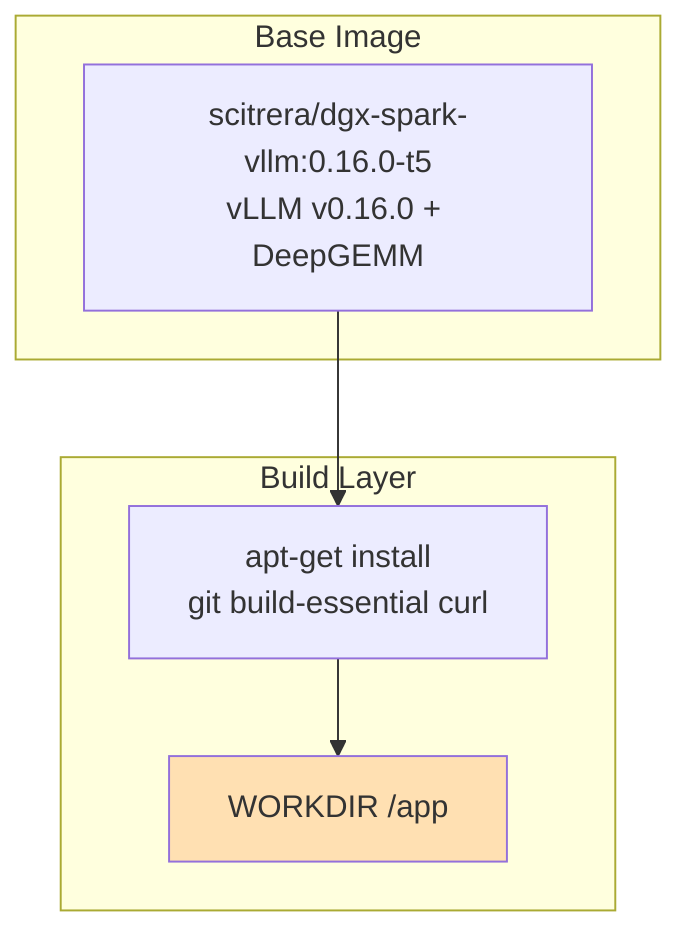

**Key Features:**
- Custom vLLM build with DeepGEMM for FP8 computation
- Optimized for multi-model serving
- Includes FlashInfer attention backend

### 2. LiteLLM (BerriAI)

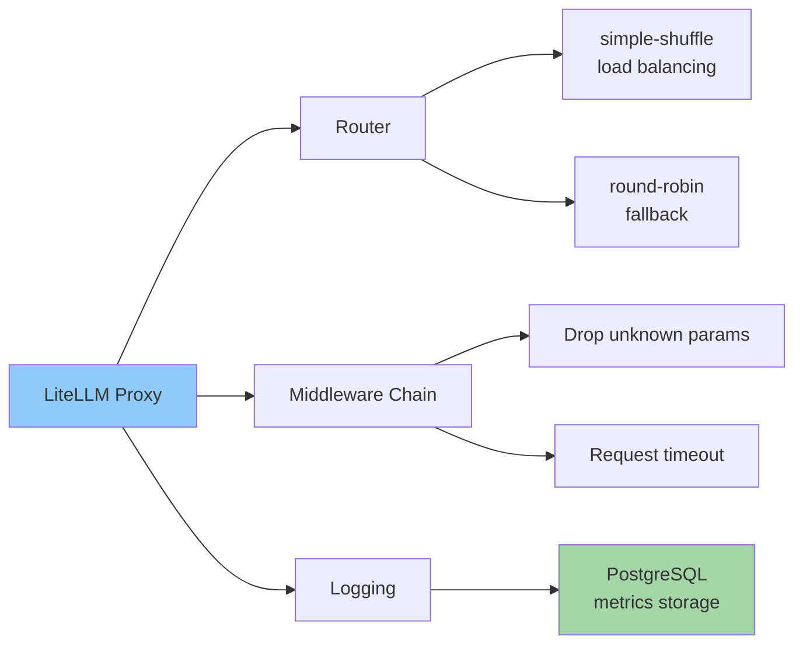

### 3. PostgreSQL (Database)

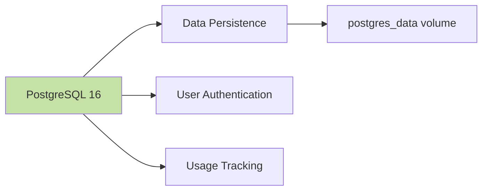

---

## Environment Variables

### Global Defaults (`vars.env`)

| Variable | Description | Default |
|----------|-------------|---------|
| `LITELLM_TEMPERATURE` | Default temperature for all models | `0.7` |
| `LITELLM_TOP_P` | Top-p sampling threshold | `0.9` |
| `LITELLM_TOP_K` | Top-k sampling pool size | `50` |
| `LITELLM_REPETITION_PENALTY` | Repetition penalty factor | `1.1` |
| `LITELLM_MAX_TOKENS` | Maximum output tokens | `128K` |
| `MAX_PARALLEL_REQUESTS` | Concurrent request limit | `16` |
| `NCCL_ENABLE_SO_RCLO | NCCL socket RCLO setting | `1` |
| `NCCL_IB_DISABLE` | Disable InfiniBand if problematic | `1` |

### Model-Specific Overrides

Each model can override any LiteLLM parameter in its `litellm:` section.

---

## Health Checks

### vLLM Container

```bash
test -f /app/generated_configs/config.yaml && \
curl -s -H 'Authorization: Bearer sk-FAKE' \
  http://localhost:8000/v1/models | grep -q vllm_agent
```

**Schedule:** Every 30s (after 150s start period)

### LiteLLM

```bash
wget --no-verbose --tries=1 http://localhost:4000/health/liveliness
```

**Schedule:** Every 30s (after 30s start period)

### PostgreSQL

```bash
pg_isready -d litellm -U llmproxy
```

**Schedule:** Every 1s (immediate start)

---

## Request Processing Pipeline

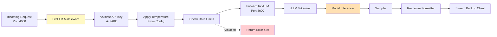

---

## Volumes Architecture

```mermaid
graph LR
    Host[Host Machine] -->|Persistent| P1[/home/user/.cache/huggingface]
    Host -->|Persistent| P2[postgres_data]

    Host -->|Read-Only| RO1[./models]
    Host -->|Read-Only| RO2[./secrets]
    Host -->|Read-Only| RO3[./scripts]
    Host -->|Read-Only| RO4[vars.env]

    Shared[tmpfs:<br/>litellm_config] -->|Read-Write| C1[vllm-container]
    Shared -->|Read-Write| C2[litellm]

    P1 -->|Model weights| vLLM
    P2 -->|Metrics| DB
    RO1 -->|YAML configs| ConfigGen
    RO2 -->|Tokens| SecretLoader
    RO3 -->|Scripts| Entry point
    RO4 -->|Defaults| ConfigGen

    style Shared fill:#e3f2fd
    style P1 fill:#e8f5e9
    style P2 fill:#e8f5e9
```

---

## Model Selection Flow

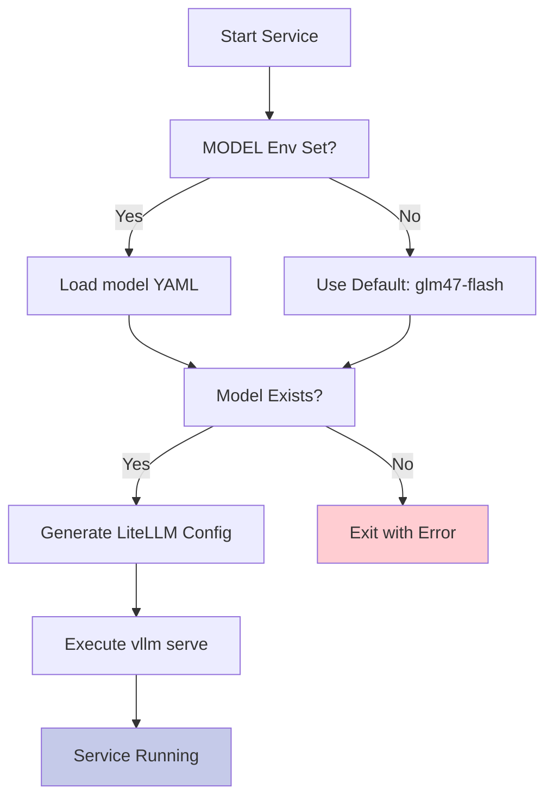

---

## Key Design Patterns

### 1. Configuration Composition

The system uses a **layered configuration approach**:
- **Global defaults** in `vars.env` apply to all models
- **Model-specific overrides** in `models/*.yml` customize per-model behavior
- **Template rendering** produces final `config.yaml`

### 2. Runtime Configuration Generation

No Docker rebuilds needed to change models - configuration is generated at container startup based on the `MODEL` environment variable.

### 3. Shared Configuration Volume

Both containers share a `tmpfs` volume for configuration files, enabling:
- Fast config file sharing
- Automatic cleanup on shutdown
- No persistent state in config directory

### 4. Secret Management via Files

Secrets are loaded from files (standard Docker practice):
```
secrets/
├── HF_TOKEN           # Hugging Face access token
└── ANTHROPIC_AUTH_TOKEN
```

### 5. OpenAI Compatibility

LiteLLM acts as a drop-in replacement adapter, translating between:
- Client expectations (OpenAI SDK)
- vLLM's native API
- Model-specific parameters

---

## Scalability Considerations

### Current Limitations

| Aspect | Limitation | Workaround |
|--------|-----------|------------|
| Model Switching | One model per container | Deploy multiple containers with different `MODEL` values |
| Concurrency | Limited by `--max-num-seqs` | Adjust in model `command` section |
| Throughput | Single GPU | Add horizontal replicas |

### Horizontal Scaling Options

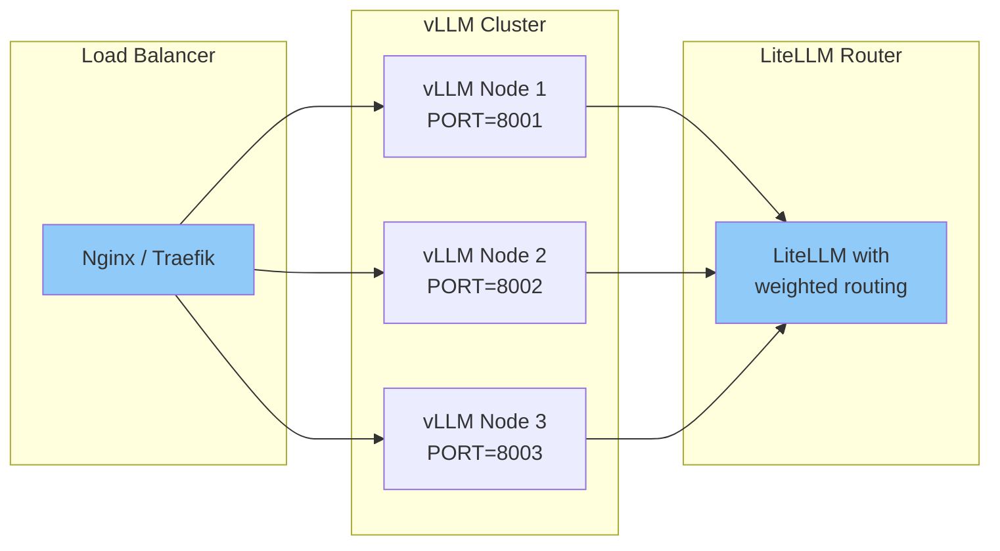

---

## Troubleshooting Architecture

### Common Issues Diagram

```mermaid
flowchart TD
    Start[Issue Detected] --> Check1[Health Checks Pass?]

    Check1 -->|No| Sol1[Check container logs:<br/>docker compose logs]
    Sol1 --> Resolve[Resolution]

    Check1 -->|Yes| Check2[API Endpoint Responsive?]

    Check2 -->|No| Sol2[Verify port binding:<br/>docker compose ps]
    Sol2 --> Resolve

    Check2 -->|Yes| Check3[Config Generated?]

    Check3 -->|No| Sol3[Check model YAML validity:<br/>python -c 'import yaml; yaml.safe_load(...)']
    Sol3 --> Resolve

    Check3 -->|Yes| Check4[Network Connectivity?]

    Check4 -->|No| Sol4[Verify docker network:<br/>docker network inspect bridge]
    Sol4 --> Resolve

    Check4 -->|Yes| Sol5[Model-specific config error]
    Sol5 --> Resolve

    style Resolve fill:#c5cae9
```

---

## Security Considerations

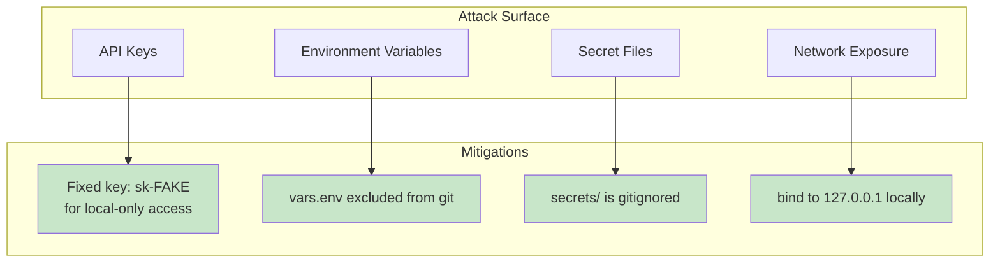

---

## Performance Tuning Parameters

### vLLM Settings

| Parameter | Location | Effect |
|-----------|----------|--------|
| `--gpu-memory-utilization` | Model command | Memory budget (default: 0.75) |
| `--max-num-seqs` | Model command | Concurrent sequences |
| `--kv-cache-dtype fp8` | Model command | KV cache compression |
| `--attention-backend flashinfer` | Model command | Faster attention |

### LiteLLM Settings

| Parameter | File | Effect |
|-----------|------|--------|
| `max_parallel_requests` | litellm_config.template.yaml | Request queue depth |
| `request_timeout` | litellm_config.template.yaml | Per-request timeout |
| `num_retries` | litellm_config.template.yaml | Retry attempts (disabled) |

---

## Future Enhancement Opportunities

### Potential Improvements

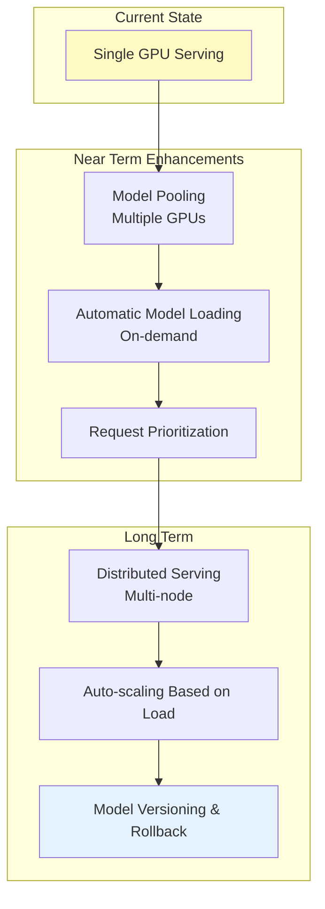

---

## Related Documentation

- [`README.md`](./README.md) - Project overview and quick start
- [`CONFIGURATION.md`](./CONFIGURATION.md) - Configuration system details
- [`MODELS.md`](./MODELS.md) - Model catalog and specifications
- [`LAUNCHER_GUIDE.md`](./LAUNCHER_GUIDE.md) - Client launcher documentation
